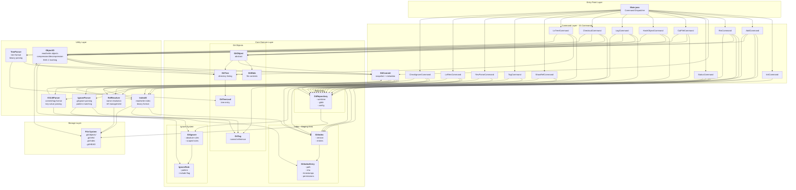

# Architectural Layers

```mermaid
graph TB
    subgraph "Entry Point Layer"
        Main["<b>Main.java</b><br/>Command Dispatcher"]
    end

    subgraph "Command Layer - 15 Commands"
        Init[InitCommand]
        Add[AddCommand]
        Rm[RmCommand]
        Commit[CommitCommand]
        Status[StatusCommand]
        CatFile[CatFileCommand]
        HashObj[HashObjectCommand]
        Log[LogCommand]
        Checkout[CheckoutCommand]
        LsTree[LsTreeCommand]
        ShowRef[ShowRefCommand]
        Tag[TagCommand]
        RevParse[RevParseCommand]
        LsFiles[LsFilesCommand]
        CheckIgnore[CheckIgnoreCommand]
    end

    subgraph "Core Domain Layer"
        subgraph "Repository"
            Repo["<b>GitRepository</b><br/>- worktree<br/>- gitdir<br/>- config"]
        end

        subgraph "Git Objects"
            GitObj["<b>GitObject</b><br/>abstract"]
            Blob["<b>GitBlob</b><br/>file contents"]
            Commit["<b>GitCommit</b><br/>snapshot + metadata"]
            Tree["<b>GitTree</b><br/>directory listing"]
            Tag2["<b>GitTag</b><br/>named reference"]
            TreeLeaf["<b>GitTreeLeaf</b><br/>tree entry"]
        end

        subgraph "Index - Staging Area"
            Index["<b>GitIndex</b><br/>- version<br/>- entries"]
            IndexEntry["<b>GitIndexEntry</b><br/>- path<br/>- sha<br/>- timestamps<br/>- permissions"]
        end

        subgraph "Ignore System"
            Ignore["<b>GitIgnore</b><br/>- absolute rules<br/>- scoped rules"]
            IgnoreRule["<b>IgnoreRule</b><br/>- pattern<br/>- include flag"]
        end
    end

    subgraph "Utility Layer"
        ObjIO["<b>ObjectIO</b><br/>read/write objects<br/>compression/decompression<br/>SHA-1 hashing"]
        IdxIO["<b>IndexIO</b><br/>read/write index<br/>binary format"]
        KVLM["<b>KVLMParser</b><br/>commit/tag format<br/>key-value parsing"]
        TreeParse["<b>TreeParser</b><br/>tree format<br/>binary parsing"]
        RefRes["<b>RefResolver</b><br/>name resolution<br/>ref management"]
        IgnParse["<b>IgnoreParser</b><br/>.gitignore parsing<br/>pattern matching"]
    end

    subgraph "Storage Layer"
        FS["<b>File System</b><br/>.git/objects/<br/>.git/refs/<br/>.git/index<br/>.git/HEAD"]
    end

    %% Main to Commands
    Main --> Init & Add & Rm & Commit & Status
    Main --> CatFile & HashObj & Log & Checkout
    Main --> LsTree & ShowRef & Tag & RevParse
    Main --> LsFiles & CheckIgnore

    %% Commands to Core
    Init --> Repo
    Add & Rm & Commit & Status & LsFiles --> Repo & Index
    CatFile & HashObj & Log & Checkout --> Repo & GitObj
    LsTree --> Repo & Tree
    ShowRef & Tag & RevParse --> Repo
    CheckIgnore --> Repo & Ignore

    %% Object Hierarchy
    GitObj --> Blob & Commit & Tree
    Commit --> Tag2
    Tree --> TreeLeaf

    %% Index Structure
    Index --> IndexEntry

    %% Ignore Structure
    Ignore --> IgnoreRule

    %% Commands to Utilities
    Add & Rm & Commit --> ObjIO & IdxIO
    Status & LsFiles --> IdxIO
    CatFile & HashObj & Log & Checkout --> ObjIO
    ShowRef & Tag & RevParse --> RefRes
    CheckIgnore & Status --> IgnParse
    Commit & Log --> KVLM
    LsTree & Checkout --> TreeParse

    %% Utilities to Core
    ObjIO --> Blob & Commit & Tree & Tag2
    KVLM --> Commit & Tag2
    TreeParse --> Tree & TreeLeaf
    IdxIO --> Index & IndexEntry
    IgnParse --> Ignore & IgnoreRule

    %% Core to Storage
    Repo --> FS
    ObjIO --> FS
    IdxIO --> FS
    RefRes --> FS
```