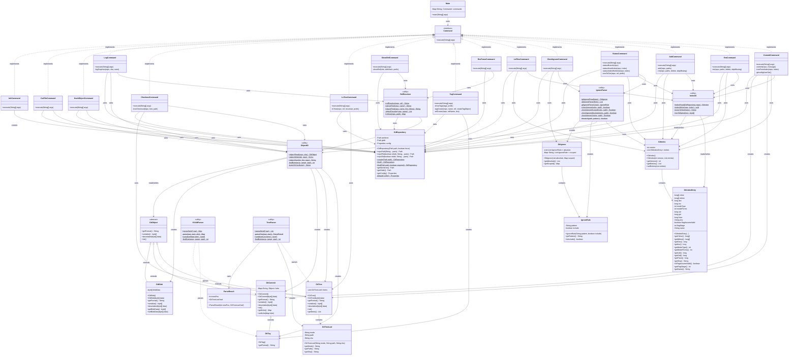

# Class Diagram

```mermaid
classDiagram
    %% Main Entry Point
    class Main {
        -Map~String, Command~ commands
        +main(String[] args)
    }

    %% Command Interface and Implementations
    class Command {
        <<interface>>
        +execute(String[] args)
    }

    class InitCommand {
        +execute(String[] args)
    }

    class CatFileCommand {
        +execute(String[] args)
    }

    class HashObjectCommand {
        +execute(String[] args)
    }

    class LogCommand {
        +execute(String[] args)
        -logGraphviz(repo, sha, seen)
    }

    class CheckoutCommand {
        +execute(String[] args)
        -treeCheckout(repo, tree, path)
    }

    class LsTreeCommand {
        +execute(String[] args)
        -lsTree(repo, ref, recursive, prefix)
    }

    class ShowRefCommand {
        +execute(String[] args)
        -showRef(refs, withHash, prefix)
    }

    class TagCommand {
        +execute(String[] args)
        -showTags(tags, prefix)
        -tagCreate(repo, name, ref, createTagObject)
        -refCreate(repo, refName, sha)
    }

    class RevParseCommand {
        +execute(String[] args)
    }

    class LsFilesCommand {
        +execute(String[] args)
    }

    class CheckIgnoreCommand {
        +execute(String[] args)
    }

    class StatusCommand {
        +execute(String[] args)
        -statusBranch(repo)
        -statusHeadIndex(repo, index)
        -statusIndexWorktree(repo, index)
        -treeToDict(repo, ref, prefix)
    }

    class AddCommand {
        +execute(String[] args)
        -add(repo, paths)
        -rm(repo, paths, delete, skipMissing)
    }

    class RmCommand {
        +execute(String[] args)
        -rm(repo, paths, delete, skipMissing)
    }

    class CommitCommand {
        +execute(String[] args)
        -commit(repo, message)
        -treeFromIndex(repo, index)
        -gitconfigUserGet()
    }

    %% Core - Repository
    class GitRepository {
        -Path worktree
        -Path gitdir
        -Properties config
        +GitRepository(Path path, boolean force)
        +repoPath(String... parts) Path
        +repoFile(boolean mkdir, String... parts) Path
        +repoDir(boolean mkdir, String... parts) Path
        +create(Path path)$ GitRepository
        +find()$ GitRepository
        +find(Path path, boolean required)$ GitRepository
        +getWorktree() Path
        +getGitdir() Path
        +getConfig() Properties
        -defaultConfig()$ Properties
    }

    %% Core - Git Objects
    class GitObject {
        <<abstract>>
        +getFormat() String
        +serialize() byte[]
        +deserialize(byte[] data)
        +init()
    }

    class GitBlob {
        -byte[] blobData
        +GitBlob()
        +GitBlob(byte[] data)
        +getFormat() String
        +serialize() byte[]
        +deserialize(byte[] data)
        +getBlobData() byte[]
        +setBlobData(byte[] data)
    }

    class GitCommit {
        -Map~String, Object~ kvlm
        +GitCommit()
        +GitCommit(byte[] data)
        +getFormat() String
        +serialize() byte[]
        +deserialize(byte[] data)
        +init()
        +getKvlm() Map
        +setKvlm(Map kvlm)
    }

    class GitTree {
        -List~GitTreeLeaf~ items
        +GitTree()
        +GitTree(byte[] data)
        +getFormat() String
        +serialize() byte[]
        +deserialize(byte[] data)
        +init()
        +getItems() List
    }

    class GitTag {
        +GitTag()
        +getFormat() String
    }

    class GitTreeLeaf {
        -String mode
        -String path
        -String sha
        +GitTreeLeaf(String mode, String path, String sha)
        +getMode() String
        +getPath() String
        +getSha() String
    }

    %% Core - Index
    class GitIndex {
        -int version
        -List~GitIndexEntry~ entries
        +GitIndex()
        +GitIndex(int version, List entries)
        +getVersion() int
        +getEntries() List
        +setEntries(List entries)
    }

    class GitIndexEntry {
        -long[] ctime
        -long[] mtime
        -long dev
        -long ino
        -int modeType
        -int modePerms
        -long uid
        -long gid
        -long fsize
        -String sha
        -boolean flagAssumeValid
        -int flagStage
        -String name
        +GitIndexEntry(...)
        +getCtime() long[]
        +getMtime() long[]
        +getDev() long
        +getIno() long
        +getModeType() int
        +getModePerms() int
        +getUid() long
        +getGid() long
        +getFsize() long
        +getSha() String
        +isFlagAssumeValid() boolean
        +getFlagStage() int
        +getName() String
    }

    %% Core - Ignore
    class GitIgnore {
        -List~List~IgnoreRule~~ absolute
        -Map~String, List~IgnoreRule~~ scoped
        +GitIgnore(List absolute, Map scoped)
        +getAbsolute() List
        +getScoped() Map
    }

    class IgnoreRule {
        -String pattern
        -boolean include
        +IgnoreRule(String pattern, boolean include)
        +getPattern() String
        +isInclude() boolean
    }

    %% Utilities
    class ObjectIO {
        <<utility>>
        +objectRead(repo, sha)$ GitObject
        +objectWrite(obj, repo)$ String
        +objectHash(in, fmt, repo)$ String
        -findByte(array, target, start)$ int
        -bytesToHex(bytes)$ String
    }

    class KVLMParser {
        <<utility>>
        +parse(byte[] raw)$ Map
        -parse(raw, start, dict)$ Map
        +serialize(Map kvlm)$ byte[]
        -findByte(array, target, start)$ int
    }

    class TreeParser {
        <<utility>>
        +parse(byte[] raw)$ List
        -parseOne(raw, start)$ ParseResult
        +serialize(List items)$ byte[]
        -findByte(array, target, start)$ int
    }

    class ParseResult {
        +int newPos
        +GitTreeLeaf leaf
        +ParseResult(int newPos, GitTreeLeaf leaf)
    }

    class IndexIO {
        <<utility>>
        +indexRead(GitRepository repo)$ GitIndex
        +indexWrite(repo, index)$ void
        -bytesToHex(bytes)$ String
        -hexToBytes(hex)$ byte[]
    }

    class RefResolver {
        <<utility>>
        +refResolve(repo, ref)$ String
        +objectFind(repo, name)$ String
        +objectFind(repo, name, fmt, follow)$ String
        -objectResolve(repo, name)$ List
        +refList(repo, path)$ Map
    }

    class IgnoreParser {
        <<utility>>
        +gitignoreRead(repo)$ GitIgnore
        -gitignoreParse(lines)$ List
        -gitignoreParse1(raw)$ IgnoreRule
        +checkIgnore(rules, path)$ boolean
        -checkIgnoreScoped(rules, path)$ Boolean
        -checkIgnoreAbsolute(rules, path)$ boolean
        -checkIgnore1(rules, path)$ Boolean
        -fnmatch(path, pattern)$ boolean
    }

    %% Relationships - Main to Commands
    Main --> Command : uses
    Command <|.. InitCommand : implements
    Command <|.. CatFileCommand : implements
    Command <|.. HashObjectCommand : implements
    Command <|.. LogCommand : implements
    Command <|.. CheckoutCommand : implements
    Command <|.. LsTreeCommand : implements
    Command <|.. ShowRefCommand : implements
    Command <|.. TagCommand : implements
    Command <|.. RevParseCommand : implements
    Command <|.. LsFilesCommand : implements
    Command <|.. CheckIgnoreCommand : implements
    Command <|.. StatusCommand : implements
    Command <|.. AddCommand : implements
    Command <|.. RmCommand : implements
    Command <|.. CommitCommand : implements

    %% Relationships - Commands to Core
    InitCommand --> GitRepository : creates
    CatFileCommand --> GitRepository : uses
    CatFileCommand --> ObjectIO : uses
    HashObjectCommand --> GitRepository : uses
    HashObjectCommand --> ObjectIO : uses
    LogCommand --> GitRepository : uses
    LogCommand --> ObjectIO : uses
    LogCommand --> RefResolver : uses
    CheckoutCommand --> GitRepository : uses
    CheckoutCommand --> GitTree : uses
    CheckoutCommand --> ObjectIO : uses
    LsTreeCommand --> GitRepository : uses
    LsTreeCommand --> GitTree : uses
    ShowRefCommand --> GitRepository : uses
    ShowRefCommand --> RefResolver : uses
    TagCommand --> GitRepository : uses
    TagCommand --> GitTag : creates
    RevParseCommand --> GitRepository : uses
    RevParseCommand --> RefResolver : uses
    LsFilesCommand --> GitRepository : uses
    LsFilesCommand --> GitIndex : uses
    LsFilesCommand --> IndexIO : uses
    CheckIgnoreCommand --> GitRepository : uses
    CheckIgnoreCommand --> GitIgnore : uses
    CheckIgnoreCommand --> IgnoreParser : uses
    StatusCommand --> GitRepository : uses
    StatusCommand --> GitIndex : uses
    StatusCommand --> IndexIO : uses
    StatusCommand --> IgnoreParser : uses
    AddCommand --> GitRepository : uses
    AddCommand --> GitIndex : uses
    AddCommand --> IndexIO : uses
    RmCommand --> GitRepository : uses
    RmCommand --> GitIndex : uses
    RmCommand --> IndexIO : uses
    CommitCommand --> GitRepository : uses
    CommitCommand --> GitCommit : creates
    CommitCommand --> GitTree : creates
    CommitCommand --> GitIndex : uses
    CommitCommand --> IndexIO : uses

    %% Relationships - Object Hierarchy
    GitObject <|-- GitBlob : extends
    GitObject <|-- GitCommit : extends
    GitObject <|-- GitTree : extends
    GitCommit <|-- GitTag : extends
    GitTree --> GitTreeLeaf : contains
    TreeParser --> ParseResult : uses
    TreeParser --> GitTreeLeaf : creates

    %% Relationships - Index
    GitIndex --> GitIndexEntry : contains

    %% Relationships - Ignore
    GitIgnore --> IgnoreRule : contains

    %% Relationships - Utilities to Objects
    ObjectIO --> GitObject : reads/writes
    ObjectIO --> GitBlob : creates
    ObjectIO --> GitCommit : creates
    ObjectIO --> GitTree : creates
    ObjectIO --> GitTag : creates
    KVLMParser ..> GitCommit : parses
    KVLMParser ..> GitTag : parses
    TreeParser ..> GitTree : parses
    IndexIO --> GitIndex : reads/writes
    IndexIO --> GitIndexEntry : reads/writes
    RefResolver --> GitRepository : uses
    RefResolver --> ObjectIO : uses
    IgnoreParser --> GitIgnore : creates
    IgnoreParser --> IgnoreRule : creates
    IgnoreParser --> GitRepository : uses
    IgnoreParser --> GitIndex : uses
    IgnoreParser --> ObjectIO : uses
```