# Diagrams

## Class Diagram

```mermaid
classDiagram
    %% Main Entry Point
    class Main {
        -Map~String, Command~ commands
        +main(String[] args)
    }

    %% Command Interface and Implementations
    class Command {
        <<interface>>
        +execute(String[] args)
    }

    class InitCommand {
        +execute(String[] args)
    }

    class CatFileCommand {
        +execute(String[] args)
    }

    class HashObjectCommand {
        +execute(String[] args)
    }

    class LogCommand {
        +execute(String[] args)
        -logGraphviz(repo, sha, seen)
    }

    class CheckoutCommand {
        +execute(String[] args)
        -treeCheckout(repo, tree, path)
    }

    class LsTreeCommand {
        +execute(String[] args)
        -lsTree(repo, ref, recursive, prefix)
    }

    class ShowRefCommand {
        +execute(String[] args)
        -showRef(refs, withHash, prefix)
    }

    class TagCommand {
        +execute(String[] args)
        -showTags(tags, prefix)
        -tagCreate(repo, name, ref, createTagObject)
        -refCreate(repo, refName, sha)
    }

    class RevParseCommand {
        +execute(String[] args)
    }

    class LsFilesCommand {
        +execute(String[] args)
    }

    class CheckIgnoreCommand {
        +execute(String[] args)
    }

    class StatusCommand {
        +execute(String[] args)
        -statusBranch(repo)
        -statusHeadIndex(repo, index)
        -statusIndexWorktree(repo, index)
        -treeToDict(repo, ref, prefix)
    }

    class AddCommand {
        +execute(String[] args)
        -add(repo, paths)
        -rm(repo, paths, delete, skipMissing)
    }

    class RmCommand {
        +execute(String[] args)
        -rm(repo, paths, delete, skipMissing)
    }

    class CommitCommand {
        +execute(String[] args)
        -commit(repo, message)
        -treeFromIndex(repo, index)
        -gitconfigUserGet()
    }

    %% Core - Repository
    class GitRepository {
        -Path worktree
        -Path gitdir
        -Properties config
        +GitRepository(Path path, boolean force)
        +repoPath(String... parts) Path
        +repoFile(boolean mkdir, String... parts) Path
        +repoDir(boolean mkdir, String... parts) Path
        +create(Path path)$ GitRepository
        +find()$ GitRepository
        +find(Path path, boolean required)$ GitRepository
        +getWorktree() Path
        +getGitdir() Path
        +getConfig() Properties
        -defaultConfig()$ Properties
    }

    %% Core - Git Objects
    class GitObject {
        <<abstract>>
        +getFormat() String
        +serialize() byte[]
        +deserialize(byte[] data)
        +init()
    }

    class GitBlob {
        -byte[] blobData
        +GitBlob()
        +GitBlob(byte[] data)
        +getFormat() String
        +serialize() byte[]
        +deserialize(byte[] data)
        +getBlobData() byte[]
        +setBlobData(byte[] data)
    }

    class GitCommit {
        -Map~String, Object~ kvlm
        +GitCommit()
        +GitCommit(byte[] data)
        +getFormat() String
        +serialize() byte[]
        +deserialize(byte[] data)
        +init()
        +getKvlm() Map
        +setKvlm(Map kvlm)
    }

    class GitTree {
        -List~GitTreeLeaf~ items
        +GitTree()
        +GitTree(byte[] data)
        +getFormat() String
        +serialize() byte[]
        +deserialize(byte[] data)
        +init()
        +getItems() List
    }

    class GitTag {
        +GitTag()
        +getFormat() String
    }

    class GitTreeLeaf {
        -String mode
        -String path
        -String sha
        +GitTreeLeaf(String mode, String path, String sha)
        +getMode() String
        +getPath() String
        +getSha() String
    }

    %% Core - Index
    class GitIndex {
        -int version
        -List~GitIndexEntry~ entries
        +GitIndex()
        +GitIndex(int version, List entries)
        +getVersion() int
        +getEntries() List
        +setEntries(List entries)
    }

    class GitIndexEntry {
        -long[] ctime
        -long[] mtime
        -long dev
        -long ino
        -int modeType
        -int modePerms
        -long uid
        -long gid
        -long fsize
        -String sha
        -boolean flagAssumeValid
        -int flagStage
        -String name
        +GitIndexEntry(...)
        +getCtime() long[]
        +getMtime() long[]
        +getDev() long
        +getIno() long
        +getModeType() int
        +getModePerms() int
        +getUid() long
        +getGid() long
        +getFsize() long
        +getSha() String
        +isFlagAssumeValid() boolean
        +getFlagStage() int
        +getName() String
    }

    %% Core - Ignore
    class GitIgnore {
        -List~List~IgnoreRule~~ absolute
        -Map~String, List~IgnoreRule~~ scoped
        +GitIgnore(List absolute, Map scoped)
        +getAbsolute() List
        +getScoped() Map
    }

    class IgnoreRule {
        -String pattern
        -boolean include
        +IgnoreRule(String pattern, boolean include)
        +getPattern() String
        +isInclude() boolean
    }

    %% Utilities
    class ObjectIO {
        <<utility>>
        +objectRead(repo, sha)$ GitObject
        +objectWrite(obj, repo)$ String
        +objectHash(in, fmt, repo)$ String
        -findByte(array, target, start)$ int
        -bytesToHex(bytes)$ String
    }

    class KVLMParser {
        <<utility>>
        +parse(byte[] raw)$ Map
        -parse(raw, start, dict)$ Map
        +serialize(Map kvlm)$ byte[]
        -findByte(array, target, start)$ int
    }

    class TreeParser {
        <<utility>>
        +parse(byte[] raw)$ List
        -parseOne(raw, start)$ ParseResult
        +serialize(List items)$ byte[]
        -findByte(array, target, start)$ int
    }

    class ParseResult {
        +int newPos
        +GitTreeLeaf leaf
        +ParseResult(int newPos, GitTreeLeaf leaf)
    }

    class IndexIO {
        <<utility>>
        +indexRead(GitRepository repo)$ GitIndex
        +indexWrite(repo, index)$ void
        -bytesToHex(bytes)$ String
        -hexToBytes(hex)$ byte[]
    }

    class RefResolver {
        <<utility>>
        +refResolve(repo, ref)$ String
        +objectFind(repo, name)$ String
        +objectFind(repo, name, fmt, follow)$ String
        -objectResolve(repo, name)$ List
        +refList(repo, path)$ Map
    }

    class IgnoreParser {
        <<utility>>
        +gitignoreRead(repo)$ GitIgnore
        -gitignoreParse(lines)$ List
        -gitignoreParse1(raw)$ IgnoreRule
        +checkIgnore(rules, path)$ boolean
        -checkIgnoreScoped(rules, path)$ Boolean
        -checkIgnoreAbsolute(rules, path)$ boolean
        -checkIgnore1(rules, path)$ Boolean
        -fnmatch(path, pattern)$ boolean
    }

    %% Relationships - Main to Commands
    Main --> Command : uses
    Command <|.. InitCommand : implements
    Command <|.. CatFileCommand : implements
    Command <|.. HashObjectCommand : implements
    Command <|.. LogCommand : implements
    Command <|.. CheckoutCommand : implements
    Command <|.. LsTreeCommand : implements
    Command <|.. ShowRefCommand : implements
    Command <|.. TagCommand : implements
    Command <|.. RevParseCommand : implements
    Command <|.. LsFilesCommand : implements
    Command <|.. CheckIgnoreCommand : implements
    Command <|.. StatusCommand : implements
    Command <|.. AddCommand : implements
    Command <|.. RmCommand : implements
    Command <|.. CommitCommand : implements

    %% Relationships - Commands to Core
    InitCommand --> GitRepository : creates
    CatFileCommand --> GitRepository : uses
    CatFileCommand --> ObjectIO : uses
    HashObjectCommand --> GitRepository : uses
    HashObjectCommand --> ObjectIO : uses
    LogCommand --> GitRepository : uses
    LogCommand --> ObjectIO : uses
    LogCommand --> RefResolver : uses
    CheckoutCommand --> GitRepository : uses
    CheckoutCommand --> GitTree : uses
    CheckoutCommand --> ObjectIO : uses
    LsTreeCommand --> GitRepository : uses
    LsTreeCommand --> GitTree : uses
    ShowRefCommand --> GitRepository : uses
    ShowRefCommand --> RefResolver : uses
    TagCommand --> GitRepository : uses
    TagCommand --> GitTag : creates
    RevParseCommand --> GitRepository : uses
    RevParseCommand --> RefResolver : uses
    LsFilesCommand --> GitRepository : uses
    LsFilesCommand --> GitIndex : uses
    LsFilesCommand --> IndexIO : uses
    CheckIgnoreCommand --> GitRepository : uses
    CheckIgnoreCommand --> GitIgnore : uses
    CheckIgnoreCommand --> IgnoreParser : uses
    StatusCommand --> GitRepository : uses
    StatusCommand --> GitIndex : uses
    StatusCommand --> IndexIO : uses
    StatusCommand --> IgnoreParser : uses
    AddCommand --> GitRepository : uses
    AddCommand --> GitIndex : uses
    AddCommand --> IndexIO : uses
    RmCommand --> GitRepository : uses
    RmCommand --> GitIndex : uses
    RmCommand --> IndexIO : uses
    CommitCommand --> GitRepository : uses
    CommitCommand --> GitCommit : creates
    CommitCommand --> GitTree : creates
    CommitCommand --> GitIndex : uses
    CommitCommand --> IndexIO : uses

    %% Relationships - Object Hierarchy
    GitObject <|-- GitBlob : extends
    GitObject <|-- GitCommit : extends
    GitObject <|-- GitTree : extends
    GitCommit <|-- GitTag : extends
    GitTree --> GitTreeLeaf : contains
    TreeParser --> ParseResult : uses
    TreeParser --> GitTreeLeaf : creates

    %% Relationships - Index
    GitIndex --> GitIndexEntry : contains

    %% Relationships - Ignore
    GitIgnore --> IgnoreRule : contains

    %% Relationships - Utilities to Objects
    ObjectIO --> GitObject : reads/writes
    ObjectIO --> GitBlob : creates
    ObjectIO --> GitCommit : creates
    ObjectIO --> GitTree : creates
    ObjectIO --> GitTag : creates
    KVLMParser ..> GitCommit : parses
    KVLMParser ..> GitTag : parses
    TreeParser ..> GitTree : parses
    IndexIO --> GitIndex : reads/writes
    IndexIO --> GitIndexEntry : reads/writes
    RefResolver --> GitRepository : uses
    RefResolver --> ObjectIO : uses
    IgnoreParser --> GitIgnore : creates
    IgnoreParser --> IgnoreRule : creates
    IgnoreParser --> GitRepository : uses
    IgnoreParser --> GitIndex : uses
    IgnoreParser --> ObjectIO : uses
```

## Architecural Layers

```mermaid
graph TB
    subgraph "Entry Point Layer"
        Main["<b>Main.java</b><br/>Command Dispatcher"]
    end

    subgraph "Command Layer - 15 Commands"
        Init[InitCommand]
        Add[AddCommand]
        Rm[RmCommand]
        Commit[CommitCommand]
        Status[StatusCommand]
        CatFile[CatFileCommand]
        HashObj[HashObjectCommand]
        Log[LogCommand]
        Checkout[CheckoutCommand]
        LsTree[LsTreeCommand]
        ShowRef[ShowRefCommand]
        Tag[TagCommand]
        RevParse[RevParseCommand]
        LsFiles[LsFilesCommand]
        CheckIgnore[CheckIgnoreCommand]
    end

    subgraph "Core Domain Layer"
        subgraph "Repository"
            Repo["<b>GitRepository</b><br/>- worktree<br/>- gitdir<br/>- config"]
        end

        subgraph "Git Objects"
            GitObj["<b>GitObject</b><br/>abstract"]
            Blob["<b>GitBlob</b><br/>file contents"]
            Commit["<b>GitCommit</b><br/>snapshot + metadata"]
            Tree["<b>GitTree</b><br/>directory listing"]
            Tag2["<b>GitTag</b><br/>named reference"]
            TreeLeaf["<b>GitTreeLeaf</b><br/>tree entry"]
        end

        subgraph "Index - Staging Area"
            Index["<b>GitIndex</b><br/>- version<br/>- entries"]
            IndexEntry["<b>GitIndexEntry</b><br/>- path<br/>- sha<br/>- timestamps<br/>- permissions"]
        end

        subgraph "Ignore System"
            Ignore["<b>GitIgnore</b><br/>- absolute rules<br/>- scoped rules"]
            IgnoreRule["<b>IgnoreRule</b><br/>- pattern<br/>- include flag"]
        end
    end

    subgraph "Utility Layer"
        ObjIO["<b>ObjectIO</b><br/>read/write objects<br/>compression/decompression<br/>SHA-1 hashing"]
        IdxIO["<b>IndexIO</b><br/>read/write index<br/>binary format"]
        KVLM["<b>KVLMParser</b><br/>commit/tag format<br/>key-value parsing"]
        TreeParse["<b>TreeParser</b><br/>tree format<br/>binary parsing"]
        RefRes["<b>RefResolver</b><br/>name resolution<br/>ref management"]
        IgnParse["<b>IgnoreParser</b><br/>.gitignore parsing<br/>pattern matching"]
    end

    subgraph "Storage Layer"
        FS["<b>File System</b><br/>.git/objects/<br/>.git/refs/<br/>.git/index<br/>.git/HEAD"]
    end

    %% Main to Commands
    Main --> Init & Add & Rm & Commit & Status
    Main --> CatFile & HashObj & Log & Checkout
    Main --> LsTree & ShowRef & Tag & RevParse
    Main --> LsFiles & CheckIgnore

    %% Commands to Core
    Init --> Repo
    Add & Rm & Commit & Status & LsFiles --> Repo & Index
    CatFile & HashObj & Log & Checkout --> Repo & GitObj
    LsTree --> Repo & Tree
    ShowRef & Tag & RevParse --> Repo
    CheckIgnore --> Repo & Ignore

    %% Object Hierarchy
    GitObj --> Blob & Commit & Tree
    Commit --> Tag2
    Tree --> TreeLeaf

    %% Index Structure
    Index --> IndexEntry

    %% Ignore Structure
    Ignore --> IgnoreRule

    %% Commands to Utilities
    Add & Rm & Commit --> ObjIO & IdxIO
    Status & LsFiles --> IdxIO
    CatFile & HashObj & Log & Checkout --> ObjIO
    ShowRef & Tag & RevParse --> RefRes
    CheckIgnore & Status --> IgnParse
    Commit & Log --> KVLM
    LsTree & Checkout --> TreeParse

    %% Utilities to Core
    ObjIO --> Blob & Commit & Tree & Tag2
    KVLM --> Commit & Tag2
    TreeParse --> Tree & TreeLeaf
    IdxIO --> Index & IndexEntry
    IgnParse --> Ignore & IgnoreRule

    %% Core to Storage
    Repo --> FS
    ObjIO --> FS
    IdxIO --> FS
    RefRes --> FS
```

## Data Flow Diagrams

### init Command

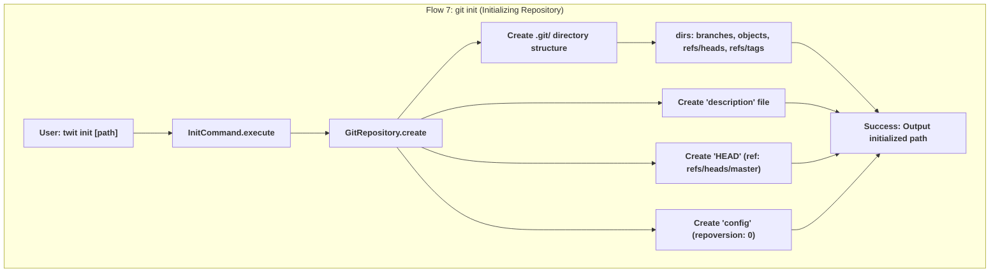

### cat-file Command

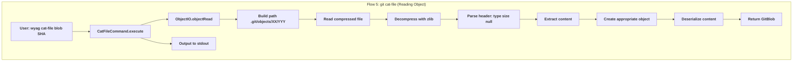

### hash-object Command

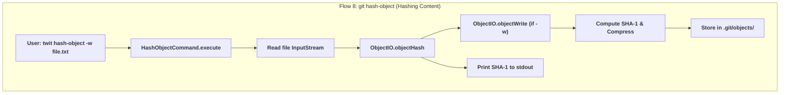

### log Command

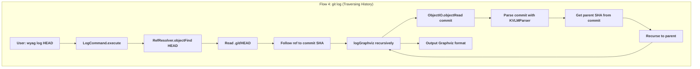

### checkout Command

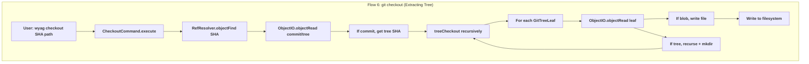

### ls-tree Command

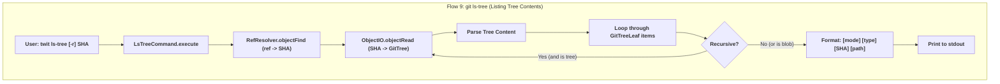

### show-ref Command

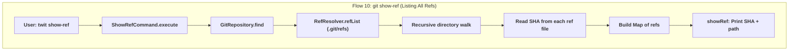

### tag Command

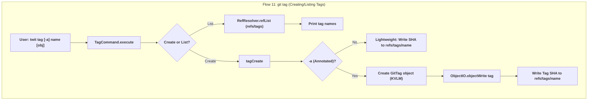

### rev-parse Command

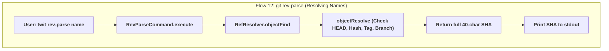

### ls-files Command

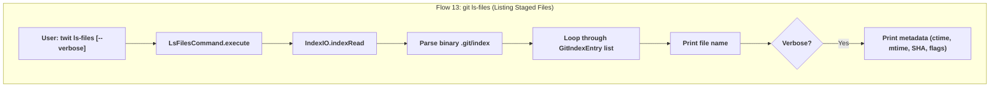

### check-ignore Command

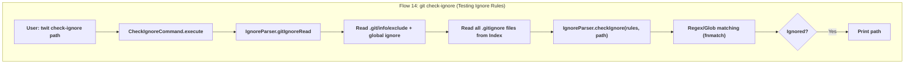

### status Command

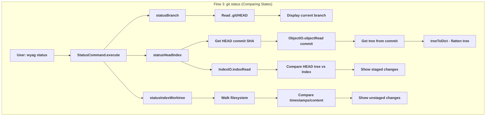

### add Command

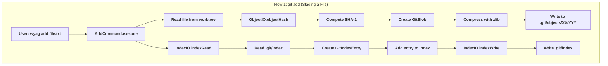

### rm Command

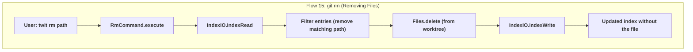
### commit Command

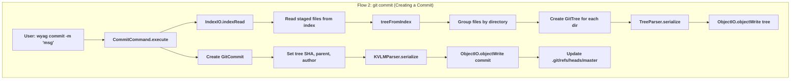

## Storage Structure Diagram

```mermaid
graph TB
    subgraph "Git Repository Structure"
        Root[".git/"]
        
        subgraph "Objects Storage"
            ObjDir["objects/"]
            Obj00["00/"]
            Obj01["01/"]
            ObjFF["ff/"]
            ObjDots["..."]
            BlobFile["a1b2c3d4e5f6... (blob)"]
            CommitFile["f1e2d3c4b5a6... (commit)"]
            TreeFile["1a2b3c4d5e6f... (tree)"]
        end
        
        subgraph "References"
            RefDir["refs/"]
            HeadsDir["heads/"]
            TagsDir["tags/"]
            Master["master -> SHA"]
            Feature["feature -> SHA"]
            V10["v1.0 -> SHA"]
        end
        
        subgraph "Working Area"
            Index["index (binary)"]
            Head["HEAD -> ref: refs/heads/master"]
            Config["config"]
            Desc["description"]
        end
    end

    Root --> ObjDir & RefDir & Index & Head & Config & Desc
    ObjDir --> Obj00 & Obj01 & ObjFF & ObjDots
    Obj00 --> BlobFile
    Obj01 --> CommitFile
    ObjFF --> TreeFile
    RefDir --> HeadsDir & TagsDir
    HeadsDir --> Master & Feature
    TagsDir --> V10

    subgraph "Object Content Examples"
        subgraph "Blob Object"
            B1["Header: blob 13 (null)"]
            B2["Content: Hello, World!"]
            B3["Stored as: .git/objects/8a/b686ea..."]
        end
        
        subgraph "Tree Object"
            T1["100644 blob a1b2c3... README.md"]
            T2["100644 blob d4e5f6... file.txt"]
            T3["040000 tree 1a2b3c... src"]
            T4["Stored as: .git/objects/7f/8e9d0c..."]
        end
        
        subgraph "Commit Object"
            C1["tree 7f8e9d0c..."]
            C2["parent 4b3c2a1f..."]
            C3["author Name email timestamp"]
            C4["committer Name email timestamp"]
            C5["(Empty Line)"]
            C6["Commit message"]
            C7["Stored as: .git/objects/2c/3d4e5f..."]
        end
    end
    B1 --> B2 --> B3
    T1 --> T2 --> T3 --> T4
    C1 --> C2 --> C3 --> C4 --> C5 --> C6 --> C7

    subgraph "Index Structure"
        I1["Header: DIRC version=2 count=3"]
        I2["Entry 1: README.md -> blob a1b2c3..."]
        I3["ctime, mtime, dev, ino, mode, size"]
        I4["Entry 2: file.txt -> blob d4e5f6..."]
        I5["ctime, mtime, dev, ino, mode, size"]
        I6["Entry 3: src/Main.java -> blob 9a8b7c..."]
        I7["ctime, mtime, dev, ino, mode, size"]
    end
    I1 --> I2 --> I3 --> I4 --> I5 --> I6 --> I7

    subgraph "Object Relationships"
        Commit1["Commit (2c3d4e)"]
        Tree1["Tree (7f8e9d)"]
        Blob1["Blob (a1b2c3) README.md"]
        Blob2["Blob (d4e5f6) file.txt"]
        SubTree["Tree (1a2b3c) src/"]
        Blob3["Blob (9a8b7c) Main.java"]
        
        Commit1 -->|tree| Tree1
        Tree1 -->|100644 README.md| Blob1
        Tree1 -->|100644 file.txt| Blob2
        Tree1 -->|040000 src| SubTree
        SubTree -->|100644 Main.java| Blob3
    end

    subgraph "Commit Graph"
        C_3["Commit 3 (master)"]
        C_2["Commit 2"]
        C_1["Commit 1"]
        C_0["Commit 0 (initial)"]
        
        C_3 -->|parent| C_2
        C_2 -->|parent| C_1
        C_1 -->|parent| C_0
        
        Master2["refs/heads/master"]
        Master2 -.-> C_3
        Head2["HEAD"]
        Head2 -.-> Master2
    end

    subgraph "Three States Comparison"
        subgraph "HEAD_State"
            H_Tree["Tree from commit"]
            H_File1["file1.txt -> blob abc"]
            H_File2["file2.txt -> blob def"]
        end
        
        subgraph "Index_State"
            Idx_Entry1["file1.txt -> blob abc"]
            Idx_Entry2["file2.txt -> blob xyz"]
            Idx_Entry3["file3.txt -> blob 123"]
        end
        
        subgraph "Worktree_State"
            W_File1["file1.txt (content abc)"]
            W_File2["file2.txt (modified!)"]
            W_File3["file3.txt (content 123)"]
            W_File4["file4.txt (untracked)"]
        end
        
        H_Tree --> H_File1 & H_File2
        H_File1 -.->|same| Idx_Entry1
        H_File2 -.->|modified| Idx_Entry2
        Idx_Entry3 -.->|new| W_File3
        Idx_Entry1 -.->|same| W_File1
        Idx_Entry2 -.->|same| W_File2
        Idx_Entry3 -.->|same| W_File3
    end

    subgraph "SHA1_Hash_Computation"
        Hash1["1. Raw content: Hello"]
        Hash2["2. Add header: blob 5 (null) Hello"]
        Hash3["3. Compute SHA-1: 5ab2f8a4..."]
        Hash4["4. Compress with zlib"]
        Hash5["5. Store at: objects/5a/b2f8a4..."]
        
        Hash1 --> Hash2 --> Hash3 --> Hash4 --> Hash5
    end

    subgraph "Parsing Examples"
        subgraph "Commit_Parsing"
            CP1["Raw bytes"]
            CP2["Find 'tree '"]
            CP3["Extract tree SHA"]
            CP4["Find 'parent '"]
            CP5["Extract parent SHA"]
            CP6["Find message start"]
            CP7["Build Map"]
            
            CP1 --> CP2 --> CP3 --> CP4 --> CP5 --> CP6 --> CP7
        end
        
        subgraph "Tree_Parsing_Logic"
            TP1["Raw bytes"]
            TP2["Find space"]
            TP3["Extract mode"]
            TP4["Find null"]
            TP5["Extract path"]
            TP6["Read 20 bytes SHA"]
            TP7["Create GitTreeLeaf"]
            
            TP1 --> TP2 --> TP3 --> TP4 --> TP5 --> TP6 --> TP7
        end
    end

    subgraph "Object_Type_Decision"
        OT1["Read from storage"]
        OT2["Decompress"]
        OT3["Parse header"]
        OT4{"Check type"}
        OT5["GitBlob"]
        OT6["GitCommit"]
        OT7["GitTree"]
        OT8["GitTag"]
        OT9["Deserialize"]
        
        OT1 --> OT2 --> OT3 --> OT4
        OT4 -->|blob| OT5 --> OT9
        OT4 -->|commit| OT6 --> OT9
        OT4 -->|tree| OT7 --> OT9
        OT4 -->|tag| OT8 --> OT9
    end
```